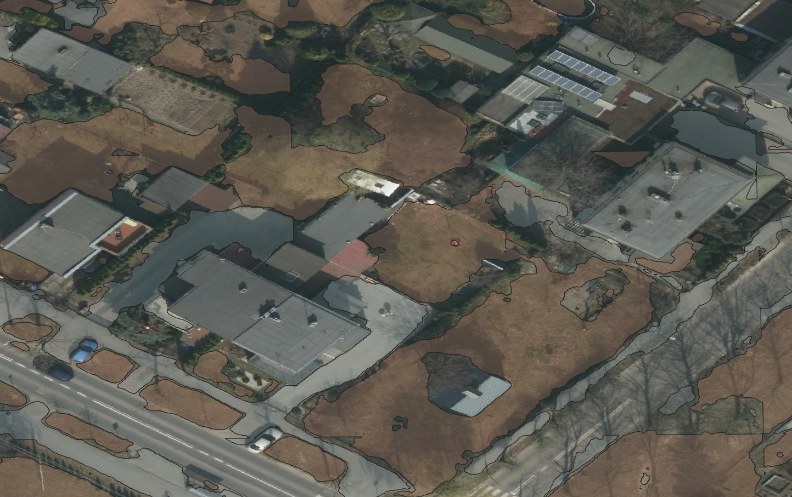
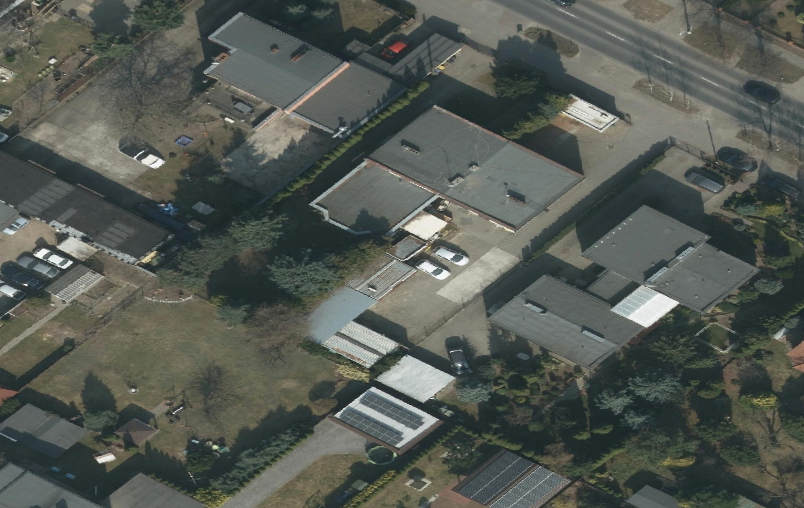
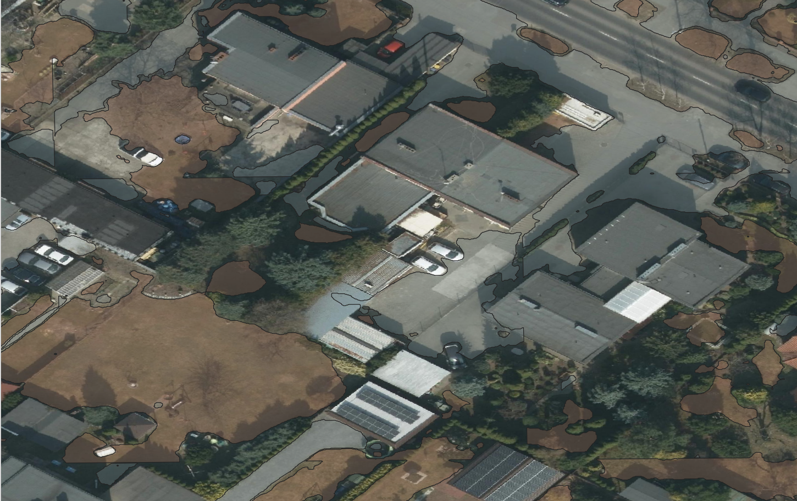
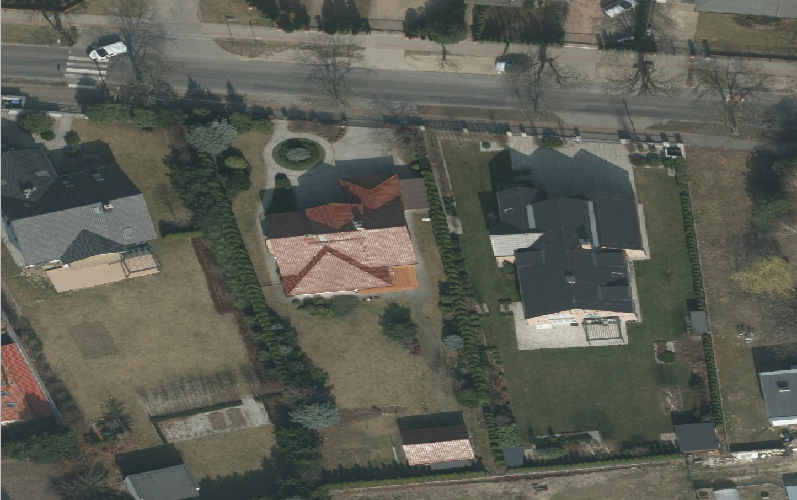
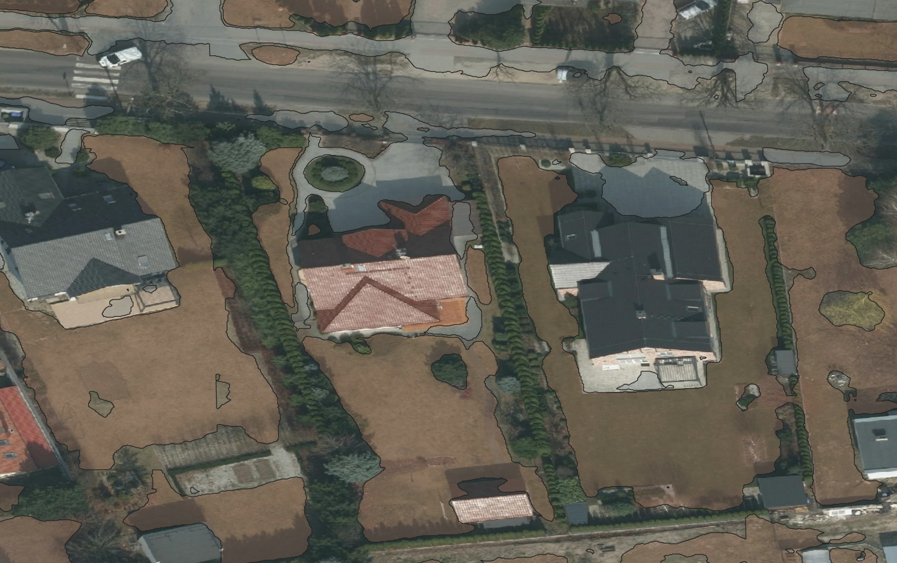
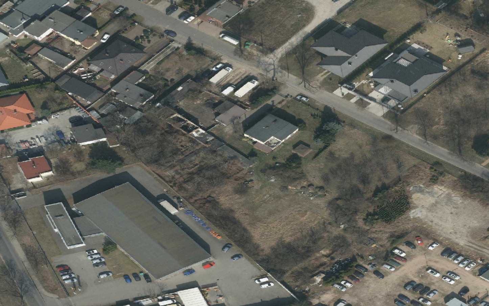
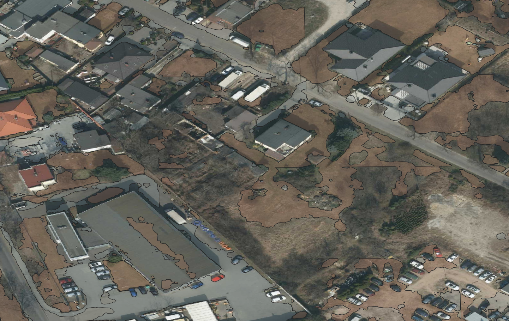
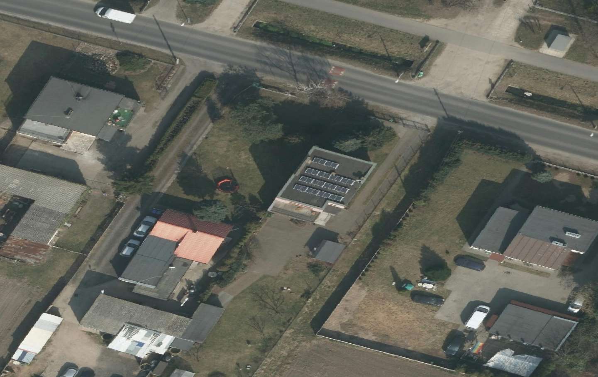
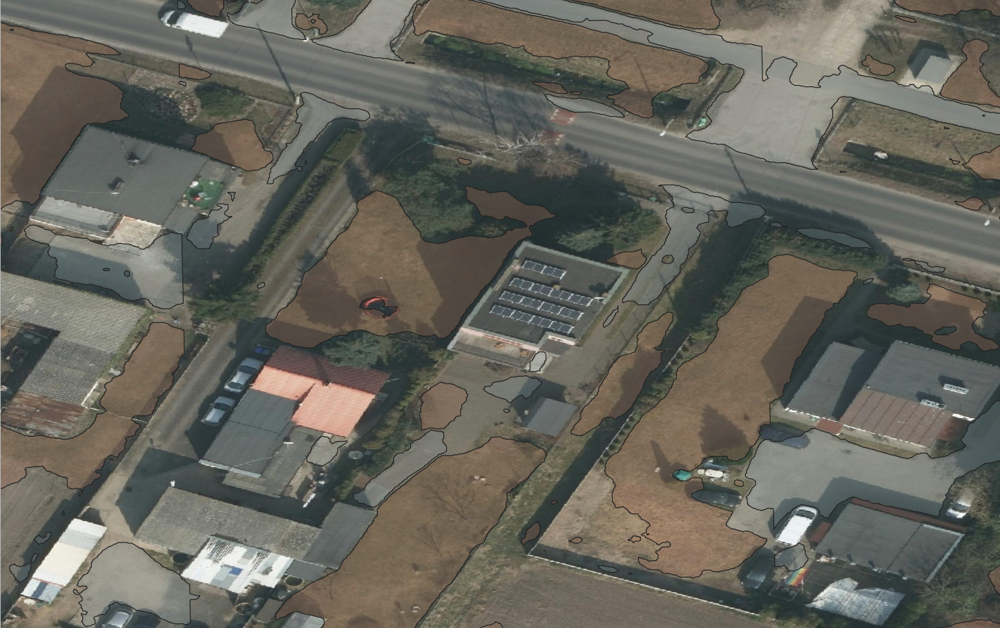

# SoLaPAfSFH
**S**egmentation **o**f **L**awns **a**nd **P**avings **A**rea **f**or **S**ingle **F**amily **H**ouses\
\
Main goal of the project was creating a model for segmentation suburbs areas into 3 categories:
- Lawns
- Pawing areas
- The rest

## Dataset
### Data Source
Unfortunately, no pre-existing datasets were available for our specific purpose. Therefore, we created our own dataset by extracting images of suburban areas in Poznań from the "Poznan 2022 aerial ortophoto high resolution" available in the QGIS plugin QuickMapServices.

Using the [Deepness](https://github.com/PUTvision/qgis-plugin-deepness) plugin, these data were processed and exported. The dataset consists of approximately 500 images of suburban areas, each measuring 512x512 pixels.

### Dataset Details
The dataset is available in this repository under data/SoLaPAfSFH.v4i.png-mask-semantic.zip.
It is divided into two subsets: train and test.

### Image and Mask Association
Each photo in the dataset has an associated mask with the same name, suffixed with _mask. For example:
- Image: image1.png
- Mask: image1_mask.png

Each photo have an unique name.

### Mask Encoding
The segmentation masks are encoded as follows:
- 0 - Background
- 1 - Lawn
- 2 - Pawing Areas
The information about the encoding can be also found in the dataset in .csv file.

## Training
- what network, how trained, what parameters
- what augmentation methods used
- what script to run the training
- remember to have a fully specified Python environemnt (Python version, requirements list with versions)
- other instructions to reproduce the training process

## Results

- Good segmentations\
As shown below, most pavements are segmented correctly, and trees are not misclassified as lawns.
<table>
  <tr>
    <td></td>
    <td></td>
  </tr>
  <tr>
    <td></td>
    <td></td>
  </tr>
</table>
- Examples of bad segmentations:
Below are examples of incorrect segmentations. In the first image, lawn is incorrectly segmented on a roof, and in the second, a significant portion of pavement is not segmented.
<table>
  <tr>
    <td></td>
    <td></td>
  </tr>
  <tr>
    <td></td>
    <td></td>
  </tr>
</table>

- Metrics on the test and train dataset

## Trained model in ONNX ready for `Deepness` plugin

To export model in ONXX format the script in `solapafsfh\cli\convert_onxx.py` is provided.\
The model is avialable in this repo in the model section, if you want to use it, just download it and merge two files into one (as shown in the gif below).

The best results in the table were achieved by the DeepLabV3+ model with the EfficientNet-b5 encoder trained with FocalDice loss. It obtained the highest results on the test set (IoU = 0.68, Accuracy = 0.81) and very high performance on the validation set (IoU = 0.67, Acc = 0.95). The training ended after 42 epochs.

| model_name | encoder_name | loss_func | training-test_iou | training-test_acc | training-valid_iou  | training-valid_acc | training-epoch
|---------------------------------|-----------------------------------|--------------------------------|---------------------------|---------------------------|----------------------------|----------------------------|------------------------|
| DeepLabV3+                      | efficientnet-b5                   | FocalDice                       | 0.68                      | 0.81                      | 0.67                       | 0.95                       | 42                  |
| DeepLabV3+                      | efficientnet-b4                   | FocalDice                       | 0.67                      | 0.80                      | 0.66                       | 0.95                       | 36                     |
| DeepLabV3+                      | efficientnet-b5                   | Dice                            | 0.66                      | 0.79                      | 0.67                       | 0.94                       | 30                     |
| DeepLabV3+                      | resnet34                          | FocalDice                       | 0.66                      | 0.79                      | 0.66                       | 0.94                       | 44                     |
| FPN                             | resnet34                          | FocalDice                       | 0.65                      | 0.79                      | 0.63                       | 0.93                       | 38                     |

## Demo instructions and video
How to use the model?\
Download zipped model avialable in this repo under `SOLAPAFSFH/model`\
Using 7zip merge the two files into one\
Use the model in QGIS\
The model was applied to the "Poznan 2022 aerial orthophoto high resolution" map.\

## People
- Piotr Zacholski
- Bruno Maruszczak
- Witold Szerszeń 
